# DevOps Logs Explorer with MongoDB

> A real-time logging simulation and exploration system that demonstrates how DevOps teams can centralize and analyze application logs using MongoDB.

## Table of Contents

- [What This App Does](#what-this-app-does)
- [Architecture](#architecture)
- [Features](#features)
- [Prerequisites](#prerequisites)
- [Installation & Setup](#installation--setup)
- [Running the Application](#running-the-application)
- [Viewing Logs in MongoDB Compass](#viewing-logs-in-mongodb-compass)
- [Example Queries](#example-queries)
- [Project Structure](#project-structure)
- [Technologies Used](#technologies-used)
- [Use Cases](#use-cases)
- [Troubleshooting](#troubleshooting)

---

## What This App Does

This application simulates a real-world microservices environment where multiple services generate logs continuously. It demonstrates:

- **Simulates a running service** with multiple microservices
- **Generates random logs every few seconds** with different severity levels
- **Pushes logs into MongoDB Atlas** for centralized cloud storage
- **Enables real-time log monitoring and analysis** using MongoDB Compass
- **Feels like real-time application logging** in production environments

Perfect for learning DevOps monitoring, centralized logging, and NoSQL database operations!

---

## Architecture

The system follows a simple yet effective pipeline for log collection and analysis:

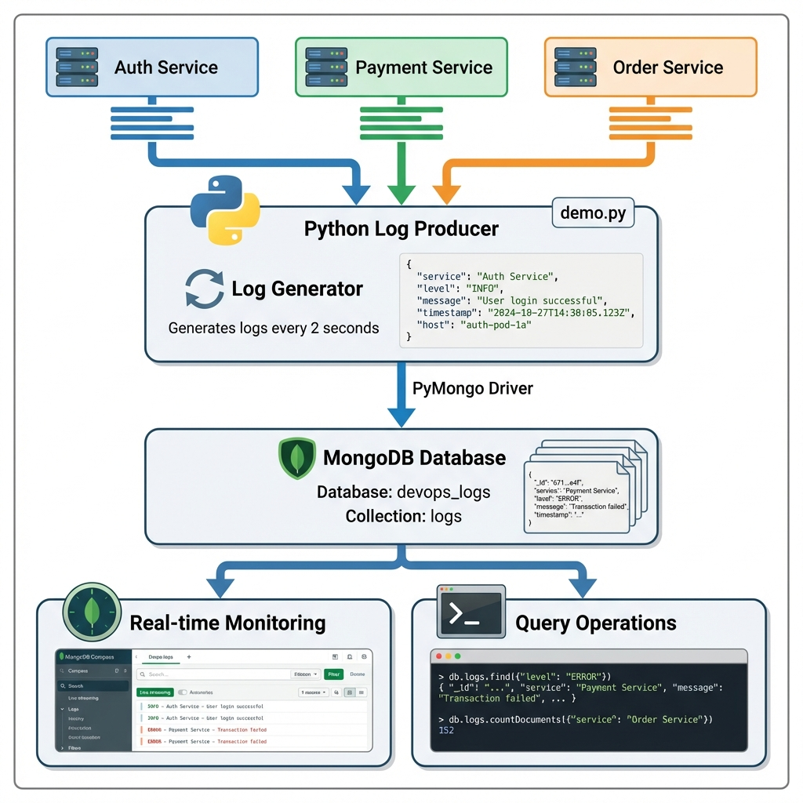

### Data Flow:
1. **Microservices** (`auth-service`, `payment-service`, `order-service`) generate logs
2. **Python Log Producer** (`demo.py`) simulates log generation every 2 seconds
3. **PyMongo Driver** handles communication with MongoDB Atlas
4. **MongoDB Atlas** stores all logs in the cloud `devops_logs` database
5. **MongoDB Compass** provides real-time monitoring and query capabilities

---

## Features

- **Continuous Log Generation**: Simulates real-time logging from multiple services
- **Multi-Service Support**: Logs from `auth-service`, `payment-service`, and `order-service`
- **Multiple Log Levels**: INFO, WARN, and ERROR levels for different severity
- **Multi-Host Simulation**: Distributed across `server-1`, `server-2`, and `server-3`
- **Real-time Monitoring**: Watch logs appear live in MongoDB Compass
- **Powerful Querying**: Filter logs by service, level, timestamp, or host
- **Cloud Storage**: Logs stored securely in MongoDB Atlas
- **Timestamp Tracking**: Every log entry includes UTC timestamp

---

## Prerequisites

Before you begin, ensure you have the following:

### Required:
- **Python 3.7+** - [Download here](https://www.python.org/downloads/)
- **MongoDB Atlas Account** - [Sign up here](https://www.mongodb.com/cloud/atlas/register) (Free)
- **MongoDB Compass** - [Download here](https://www.mongodb.com/try/download/compass)

### Verify Python Installation:
```bash
# Check Python version
python --version
```

---

## Installation & Setup

Follow these steps to set up the project from scratch:

### Step 1: Create a Free MongoDB Atlas Cluster

1. Sign up at [MongoDB Atlas](https://www.mongodb.com/cloud/atlas/register)
2. Click **Create** to build a new cluster
3. Choose **FREE** tier (M0 Sandbox)
4. Select your preferred cloud provider (AWS, Google Cloud, or Azure)
5. Choose a region closest to your location
6. Click **Create Cluster**
7. Wait 3-5 minutes for the cluster to be ready

### Step 2: Configure Network Access

1. In the Atlas dashboard, click **Network Access** in the left sidebar
2. Click **Add IP Address**
3. Select **Allow Access from Anywhere** (0.0.0.0/0)
   - This allows connections from any IP address
   - **Note:** For production, restrict to specific IPs
4. Click **Confirm**

### Step 3: Create Database User

1. Click **Database Access** in the left sidebar
2. Click **Add New Database User**
3. Select **Password** as authentication method
4. Enter a username (e.g., `admin`)
5. Enter a strong password and **save it securely**
6. Under **Database User Privileges**, select **Read and write to any database**
7. Click **Add User**

### Step 4: Connect MongoDB Compass

1. In the Atlas dashboard, click **Databases**
2. Click **Connect** on your cluster
3. Choose **Connect using MongoDB Compass**
4. Copy the connection string:
   ```
   mongodb+srv://<username>:<password>@cluster0.xxxxx.mongodb.net/
   ```
5. Replace `<username>` with your database username
6. Replace `<password>` with your database password
7. Open **MongoDB Compass**
8. Paste the connection string
9. Click **Connect**

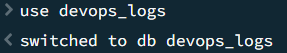

### Step 5: Create Database and Collection

1. In MongoDB Compass, click **Create Database**
2. Database name: `devops_logs`
3. Collection name: `logs`
4. Click **Create Database**

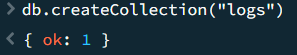

### Step 6: Set Up Python Environment

Create a project directory:

```bash
mkdir devops_logs_explorer
cd devops_logs_explorer
```


### Step 7: Create Python Virtual Environment

Create and activate a virtual environment to isolate dependencies:

```bash
# Create virtual environment
python3 -m venv .venv
```


```bash
# Activate virtual environment
# On Windows:
.venv\Scripts\activate

# On macOS/Linux:
source .venv/bin/activate
```

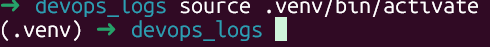

### Step 8: Install Dependencies

Install PyMongo, the official MongoDB Python driver:

```bash
pip install pymongo
```

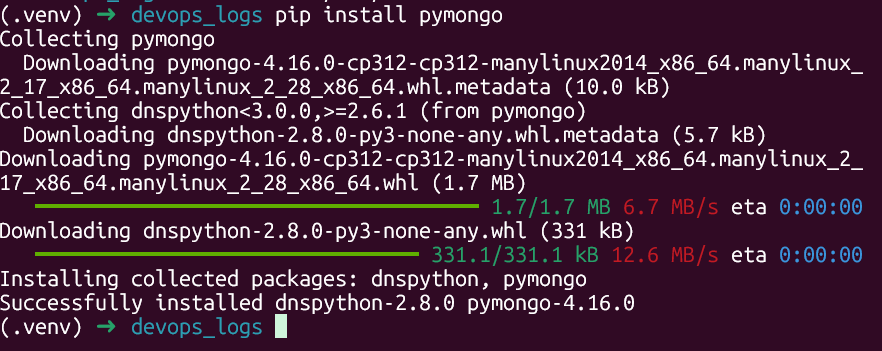

### Step 9: Create the Log Producer Script

Create a file named `demo.py` with the following code:

```python
import time
import random
from datetime import datetime
from pymongo import MongoClient

# 1. Connect to MongoDB Atlas
# Replace with your connection string from Step 4
client = MongoClient("mongodb+srv://<username>:<password>@cluster0.xxxxx.mongodb.net/")
db = client["devops_logs"]
logs_collection = db["logs"]

services = ["auth-service", "payment-service", "order-service"]
levels = ["INFO", "WARN", "ERROR"]

# 2. Keep generating logs
while True:
    log = {
        "service": random.choice(services),
        "level": random.choice(levels),
        "message": "Dummy log message",
        "timestamp": datetime.utcnow(),
        "host": f"server-{random.randint(1,3)}"
    }

    logs_collection.insert_one(log)
    print("Inserted log:", log)

    time.sleep(2)  # wait 2 seconds
```

**Important:** Replace the connection string with your actual Atlas connection string from Step 4.


---

## Running the Application

### Step 1: Execute the Log Producer

Start generating logs by running the Python script:

```bash
python demo.py
```

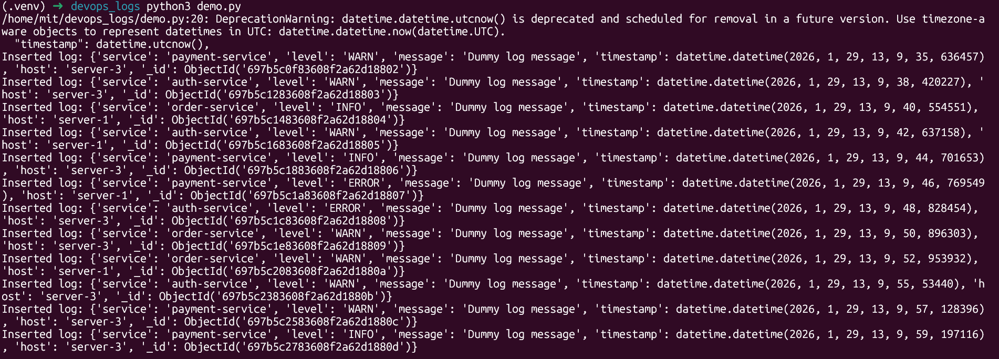

You'll see logs printing continuously in the terminal:

```
Inserted log: {'service': 'auth-service', 'level': 'ERROR', 'message': 'Dummy log message', 'timestamp': datetime.datetime(2026, 1, 29, 13, 47, 53), 'host': 'server-1', '_id': ObjectId('...')}
Inserted log: {'service': 'payment-service', 'level': 'INFO', 'message': 'Dummy log message', 'timestamp': datetime.datetime(2026, 1, 29, 13, 47, 55), 'host': 'server-2', '_id': ObjectId('...')}
```

### Step 2: The Script Will:
- [√] Connect to MongoDB Atlas using your connection string
- [√] Access the `devops_logs` database
- [√] Insert logs into the `logs` collection
- [√] Insert a new log document every 2 seconds
- [√] Continue running until you stop it (Ctrl+C)

---

## Viewing Logs in MongoDB Compass

MongoDB Compass provides a visual interface to explore your logs in real-time.

### Real-time Monitoring

1. Keep `demo.py` running
2. In MongoDB Compass, navigate to `devops_logs` → `logs`
3. Click the **Refresh** button to see new logs appear

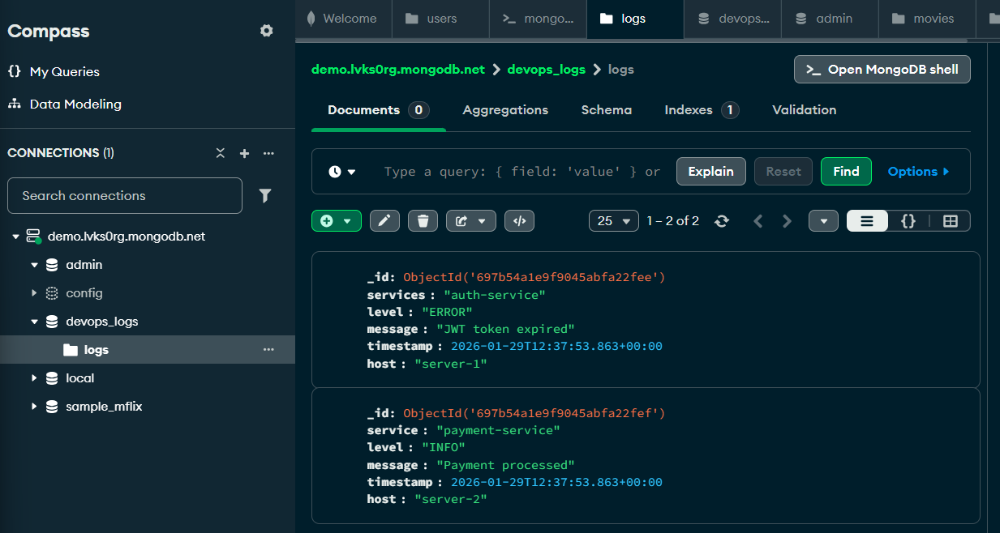

As your Python script continues running, you'll see the log count increasing:

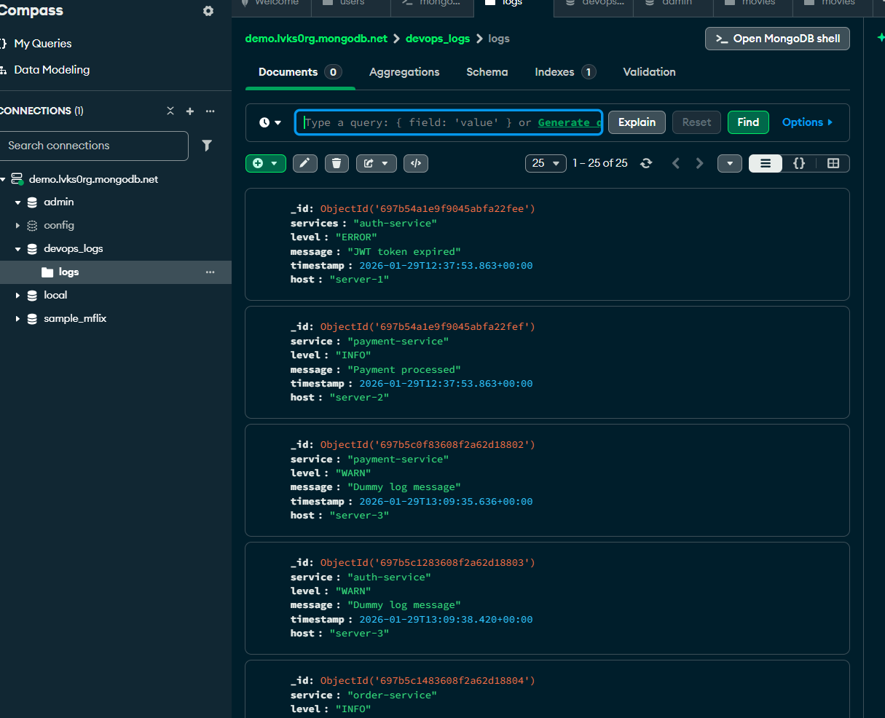

---

## Example Queries

MongoDB provides powerful querying capabilities. Try these queries while the app is running!

### Query 1: Filter by Log Level - INFO

Find all INFO level logs:

```javascript
db.logs.find({ level: "INFO" })
```

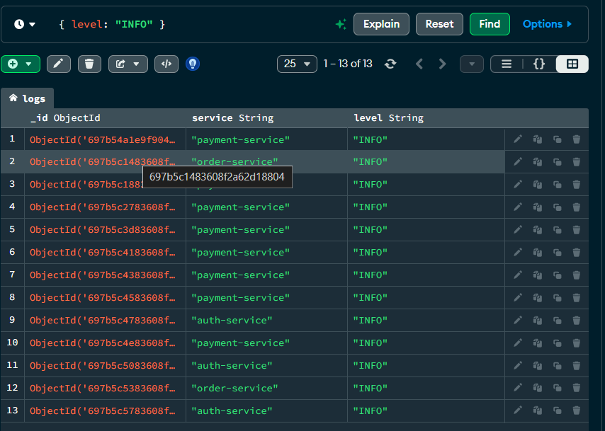

### Query 2: Filter by Log Level - ERROR

Find all ERROR level logs for debugging:

```javascript
db.logs.find({ level: "ERROR" })
```

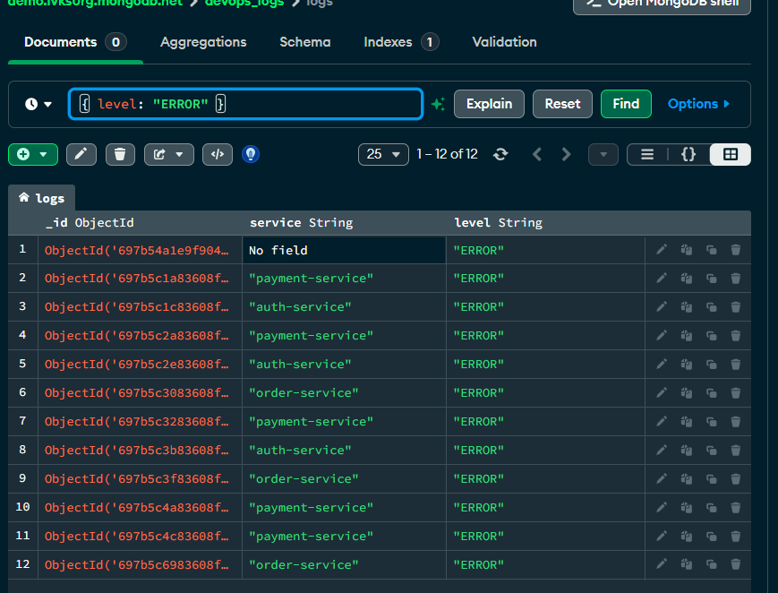

### Query 3: Filter by Service

Find logs from a specific service:

```javascript
db.logs.find({ service: "payment-service" })
```

### Query 4: Sort by Timestamp

Get the most recent logs first:

```javascript
db.logs.find().sort({ timestamp: -1 })
```

### Query 5: Complex Query

Find ERROR logs from payment-service:

```javascript
db.logs.find({ 
  service: "payment-service", 
  level: "ERROR" 
})
```

### Query 6: Count Logs by Level

```javascript
db.logs.aggregate([
  { $group: { _id: "$level", count: { $sum: 1 } } }
])
```

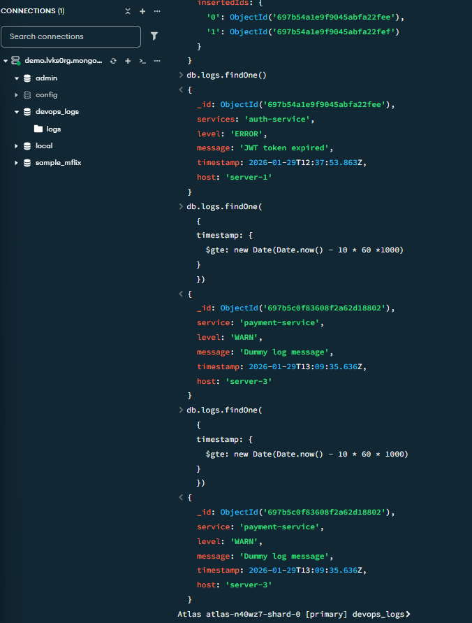

---

### Log Document Structure:
```json
{
  "_id": ObjectId("..."),
  "service": "auth-service",
  "level": "ERROR",
  "message": "Dummy log message",
  "timestamp": ISODate("2026-01-29T13:47:53.000Z"),
  "host": "server-1"
}
```

---


## Troubleshooting

### Issue 1: MongoDB Atlas Connection Error
**Error:** `ServerSelectionTimeoutError: connection refused`

**Solution:**
- Verify your connection string is correct
- Ensure network access is configured for 0.0.0.0/0
- Check your username and password are correct
- Confirm your cluster is active and running

### Issue 2: PyMongo Not Found
**Error:** `ModuleNotFoundError: No module named 'pymongo'`

**Solution:**
- Activate virtual environment: `source .venv/bin/activate` (Linux/Mac) or `.venv\Scripts\activate` (Windows)
- Reinstall PyMongo: `pip install pymongo`

### Issue 3: Authentication Failed
**Error:** `Authentication failed`

**Solution:**
- Double-check your database username and password
- Ensure you created a database user with read/write permissions
- Verify special characters in password are URL-encoded in connection string

### Issue 4: Network Access Denied
**Error:** `connection refused`

**Solution:**
- Go to Network Access in Atlas dashboard
- Ensure 0.0.0.0/0 is in the IP whitelist
- Wait 1-2 minutes for network changes to propagate

---

## Contributing

Contributions are welcome! Feel free to:

1. Fork the repository
2. Create a feature branch (`git checkout -b feature/amazing-feature`)
3. Commit your changes (`git commit -m 'Add amazing feature'`)
4. Push to the branch (`git push origin feature/amazing-feature`)
5. Open a Pull Request

---

**Happy Logging!**
